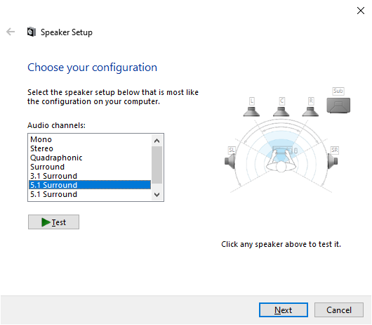

# Wireless Surround Speaker System with Scavenged Smart Speakers and Open Source Software

(There are so many 'S's in the title.)

[Scream](https://github.com/duncanthrax/scream) is an open-source virtual network sound card for Windows. It sends uncompressed sound [PCM](https://en.wikipedia.org/wiki/Pulse-code_modulation) data over multicast (hence 'scream') UDP or optionally unicast UDP packets. Even though uncompressed, the bandwidth of a 7.1 channel, 16bit, 48kHz PCM stream is only 6.14Mbps, well within the capabilities of today's WiFi hardware.

PHICOMM R1 is a smart speaker whose cloud service had been shutdown and not 'smart' anymore so I'm able to get an unused one for about $11 in China. It comes with Android 5.1, 5GHz WiFi and an open network ADB port, which make it a decent wireless speaker node.

Today we're going to set up a 5.1 wireless surround speaker system for a PC (running Windows) with 6 PHICOMM R1 speakers.

While multicast works well in wired networks, [multicast in WiFi has several limitations](https://en.wikipedia.org/wiki/IP_multicast#Wireless_(802.11)_considerations) that make me turn to unicast instead. First, for most of the time, wireless AP can't transmit multicast packets continuously and bandwidth is limited; Second, multicast packets don't have retransmission mechanisms so that they are prone to data loss, which is unbearable in our case.

So I created a fork on my [GitHub](https://github.com/ReeseWang/scream) to add the functionality of splitting multi-channel audio over multiple destinations (e.g. Front Left and Front Center to 192.168.0.2, while Front Center and Front Right to 192.168.0.3).

## Build and Install Scream on Windows

### Configure Endpoints in the Source Code

At the time of writing (commit [090f873](https://github.com/ReeseWang/scream/commit/090f873436da0f55cf7918c6c6735fa4ea47e600)), destination(endpoint) info is hard-coded in `Scream/savedata.cpp` temporarily. So you should change the constructor of `CSaveData` class and some array declarations in `CSaveData::Initialize` to suit your environment:

```
CSaveData::CSaveData() : m_bNumEndPoints(6), ...
{
    ...
}

...

NTSTATUS CSaveData::Initialize(...) {
    ...
    PCHAR ips[] = {
        "192.168.90.241",
        "192.168.90.242",
        "192.168.90.243",
        "192.168.90.244",
        "192.168.90.245",
        "192.168.90.246"
    };
    USHORT ports[] = { 4010, 4010, 4010, 4010, 4010, 4010 };
    WORD masks[] = { 0x1, 0x2, 0x400, 0x200, 0x4, 0x8 };
    ...
}
```

The array `WORD masks[]` stores information about what channels to send to each endpoint. The mapping between bitfields and audio channels can be found at [KSAUDIO_CHANNEL_CONFIG structure documentation](https://docs.microsoft.com/en-us/windows-hardware/drivers/ddi/ksmedia/ns-ksmedia-ksaudio_channel_config). Therefore the code above shows the channels sent to endpoint 0 through 5 are Front Left (`0x1`), Front Right (`0x2`), Side Right (`0x400`), Side Left (`0x200`), Front Center (`0x4`) and Low Frequency (`0x8`), respectively. You can have multiple bits set in certain members of  `masks[]` if you want.

### Build with Visual Studio

Scream is a Windows device driver running in kernel space. Building it requires [Visual Studio](https://visualstudio.microsoft.com/) with C++ components and [Windows Driver Kit (WDK)](https://docs.microsoft.com/en-us/windows-hardware/drivers/download-the-wdk), which must be installed separately.

Launch Visual Studio Installer and make sure something similar to *MSVC v142 - VS2019 C++ x64/x86 Spectre-mitigated libs (v14.24)*, *C++ ATL for latest v142 build tools with Spectre Mitigations (x86 & x64)* and *MSVC v142 - VS2019 C++ x64/x86 build tools* are installed.

Start Visual Studio and open `Scream.sln`, Click **Build -> Build Solution** to build our driver file. There are 3 files generated: `scream.cat`, `Scream.inf` and `Scream.sys`.

The build process should complete without error. If the linker complains about undefined reference, right-click **Scream (in the Solution Explorer) -> Properties -> Configuration Properties -> Linker -> Input -> Additional Dependencies** and add 3 libraries:

```bash
$(DDK_LIB_PATH)portcls.lib
$(DDK_LIB_PATH)netio.lib
$(DDK_LIB_PATH)stdunk.lib
```

If you want to debug the driver, you should prepare another PC or virtual machine running Windows and refer to [Deploying a Driver to a Test Computer](https://docs.microsoft.com/en-us/windows-hardware/drivers/develop/deploying-a-driver-to-a-test-computer).

### Install Scream on Your PC

Sadly, before I'm able to get a certificate for the driver, one must [disable Signed Driver Enforcement](https://windowsreport.com/driver-signature-enforcement-windows-10/) before installing it.

Locate `devcon.exe` provided by WDK -- typically inside `C:\Program Files (x86)\Windows Kits\10\Tools\x64` -- and launch a Command Prompt or PowerShell in administrator mode here.

Run `.\devcon.exe remove *Scream` if you want to remove previously installed Scream.

Run `.\devcon.exe install path\to\Scream.inf *Scream` to install.

A warning should show up. Click *Install anyway* or similar buttons.

## Build and Install scream-android on PHICOMM R1

There is a simple Scream receiver for Android that can run on our R1 with [a little modification](https://github.com/ReeseWang/scream-android/commit/98f113c141da2ce00a235e2134485e8cef556363).

### Build scream-android with Android Studio

Download and install the latest [Android Studio](https://developer.android.com/studio), clone the [code](https://github.com/ReeseWang/scream-android) and open the project in Android Studio.

Click **Build -> Build Bundle(s) / APK(s) -> Build APK(s)** to generate the `.apk` file.

### Install scream-android on PHICOMM R1

Locate your ADB executable provided by Android SDK, typically inside `C:\Users\USERNAME\AppData\Local\Android\Sdk\platform-tools`, add it to your `$PATH` or launch Command Prompt or PowerShell here.

After connecting PHICOMM R1 to your WiFi using their APP, connect to it's network ADB port with `.\adb.exe connect xxx.xxx.xx.xx`. If everything is right, the result would be `connected to xxx.xxx.xx.xx:5555`.

If multiple R1 is connected through ADB, you can list them with `.\adb.exe devices -l`:

```
List of devices attached
192.168.90.241:5555    device product:rk322x_echo model:rk322x_box device:rk322x_echo transport_id:13
192.168.90.242:5555    device product:rk322x_echo model:rk322x_box device:rk322x_echo transport_id:2
192.168.90.243:5555    device product:rk322x_echo model:rk322x_box device:rk322x_echo transport_id:3
192.168.90.245:5555    device product:rk322x_echo model:rk322x_box device:rk322x_echo transport_id:5
192.168.90.246:5555    device product:rk322x_echo model:rk322x_box device:rk322x_echo transport_id:6
```

And use their transport ID to declare which device are you running ADB commands on:

```
.\adb.exe -t TRANSPORT_ID shell sh
```

Push the generated APK to R1:

```
.\adb.exe push path\to\app-debug.apk /data/local/tmp
```

And install the APP:

```
.\adb.exe shell /system/bin/pm install -t /data/local/tmp/app-debug.apk
```

Then launch the APP:

```
.\adb.exe shell /system/bin/am start it.m2app.screamreceiver/it.m2app.screamreceiver.MainActivity
```

If you want to get some visual feedback, you can use [scrcpy](https://github.com/Genymobile/scrcpy) to watch the 'screen' of R1 through ADB.

### Remove the Stock Voice Assistant on PHICOMM R1

Now we have 6 'smart' speakers running, the sight of them being activated simultaneously by accident would be spectacular.

Thanks to the tip provided [here](https://www.maketecheasier.com/uninstall-system-apps-without-root-android/), we can remove the annoying voice assistant without rooting the device.

A bit of warning: You won't be able to modify network settings of R1 via their APP after uninstalling the voice assistant. OTA updating after uninstalling will brick the device, so it's recommended to update to the latest version (3448) before uninstalling the voice assistant. For performing OTA updates, look for posts in this [forum](https://www.right.com.cn/forum/forum.php?mod=forumdisplay&fid=158&filter=typeid&typeid=42) (Chinese).

The command for removing the stock voice assistant is here:

```
.\adb.exe shell /system/bin/pm uninstall -k --user -0 com.phicomm.speaker.device
```

## Device Setup on Windows

Launch **Control Panel -> Hardware and Sound -> Sound -> Scream (WDM) -> Properties -> Advanced -> Default Format**, select *16 bit, 44100 Hz* or *16 bit, 48000 Hz* here and hit OK, as scream-android doesn't support higher bit depth or sample rate.

Click **Configure** in the Sound dialogue, choose 5.1 Surround with side speakers and complete the Speaker Setup. If you want to use 5.1 Surround with rear speakers, make sure to change the endpoint channel masks accordingly.



## Scripts to Set Volume on PHICOMM R1

I created aliases in Bash for remote controlling 6 speakers simultaneously from my Linux laptop.

```bash
# Connect All R1s via ADB
alias r1connectall="for ((i=1;i<=6;i+=1)); do adb connect 192.168.90.24\$i; done"
# Execute ADB command on all R1 devices
alias adball="adb devices -l | grep rk322x_box | rev | cut -f 1 -d ' ' | rev | cut -f 2 -d : | xargs -P 0 -I transid adb -t transid"
# Launch scream-android on all R1s
alias screamall="adball shell /system/bin/am start it.m2app.screamreceiver/it.m2app.screamreceiver.MainActivity"
# Volume Up
alias vu="adball shell service call audio 2 i32 3 i32 1"
# Volume Down
alias vd="adball shell service call audio 2 i32 3 i32 -1"
# Set/Synchronize Volume, accept an integer from 0 to 15 as argument
alias vs="adball shell service call audio 4 i32 3 i32"
# Mute
alias vm="vs 0"
```